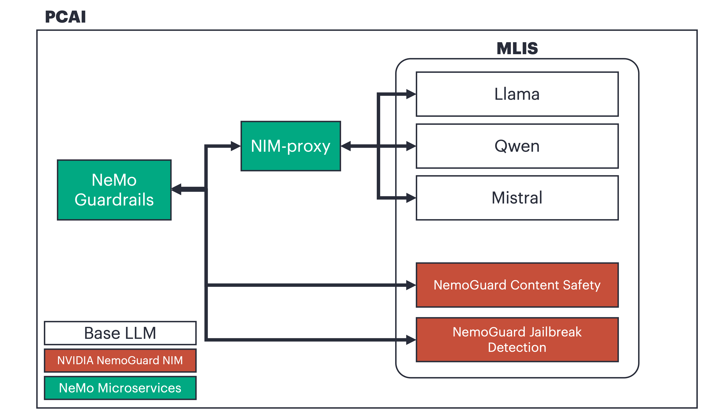

# NeMo Guardrails microservices in PCAI
Demonstrate NeMo Microservice python SDK for NeMo Guardrails in PCAI. 

# Prerequisites
- Deploy models in MLIS ( Base model, NeMoGuard models ) and generate tokens for each models
- Deploy NeMo Guadrails Microservice on PCAI

# Architecture in PCAI

